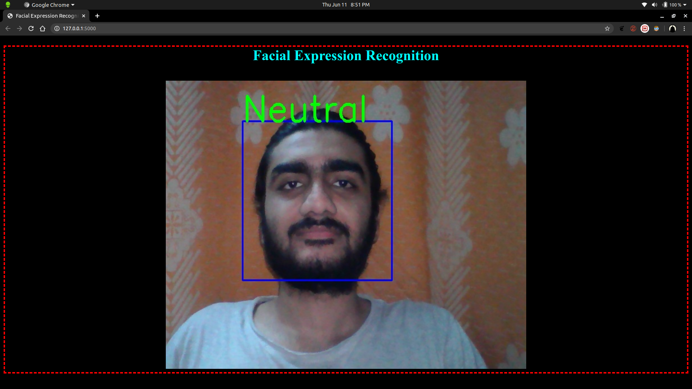
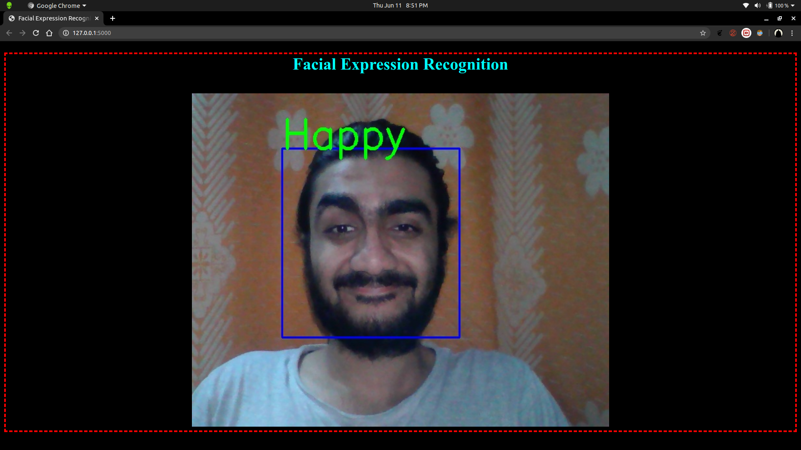
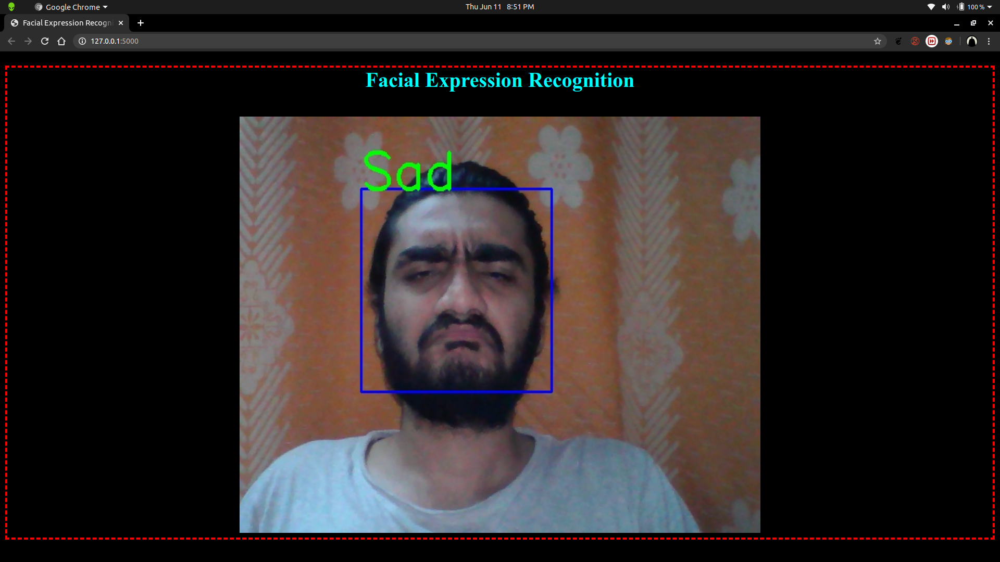
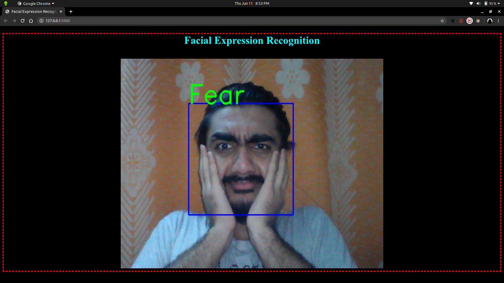

# Facial_Expression_Recognition Application 

--------------------------------------------------------------------------
## Dataset: FER 2013 (Kaggle)

---------------------------------------------------------------------------
## Trained a CNN similar to VGG using Tensorflow/Keras locally using GPU and deployed using FLASK

---------------------------------------------------------------------------.

# NEUTRAL

---------------------------------------------------------------------------------------------------------------------------------------

# HAPPY

---------------------------------------------------------------------------------------------------------------------------------------

# SAD

----------------------------------------------------------------------------------------------------------------------------------------

# ANGRY

---------------------------------------------------------------------------

# SURPRISE

---------------------------------------------------------------------------------------------------------------------------------------
---------------------------------------------------------------------------

# FEAR

---------------------------------------------------------------------------------------------------------------------------------------

Unfortunately DISGUST was not recognised

